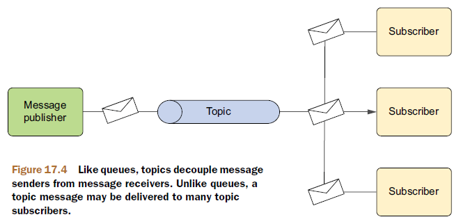

像RMI、HTTP invoker等远程调用机制，以及Web服务、RESTful都是同步通信，而消息则属于异步通信。

在异步消息中有两个主要概念：消息代理（message broker）和目的地（destination）。

当一个应用发送信息时，会将消息交给一个消息代理（相当于邮局）。消息代理可以确保消息被投递到指定的目的地，同时解放发送者，使其能够继续进行其他的业务。

有两种通用的目的地：队列（queue）和主题（topic）。它们分别对应两种消息模型：点对点模型和发布/订阅模型。

# 消息模型

## 点对点模型

在点对点模型中，每一条消息都有一个发送者，并且都只会被一个接收者接收。

尽管消息队列中中的每条消息只会被一个接收者取走，但是并不意味着只能使用一个接收者从队列中获取消息。事实上，通常会有多个接收者来处理队列中的消息。类似于银行排队办理业务一样，银行柜员类似于接收者。

在点对点模型中，如果有多个接收者监听队列，我们是无法知道某条特定消息会由哪一个接收者处理。

## 发布/订阅模型

在发布/订阅模型中，消息会发送给一个主题。与队列类似，多个接收者都可以监听一个主题。但是，与队列不同的是，消息不再是只投递给一个接收者，而是主题的所有订阅者都会接收到此消息的副本。类似于杂志发行商与杂志订阅者。

# JMS

# AMQP

# WebSocket

# STOMP

# Email