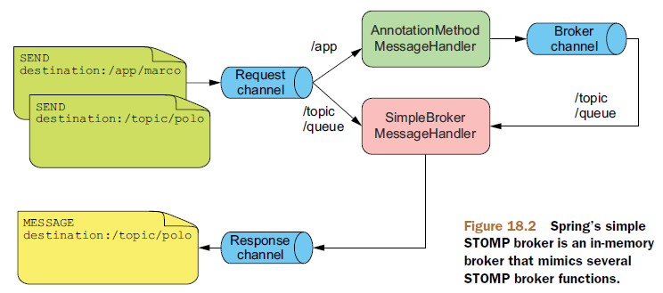
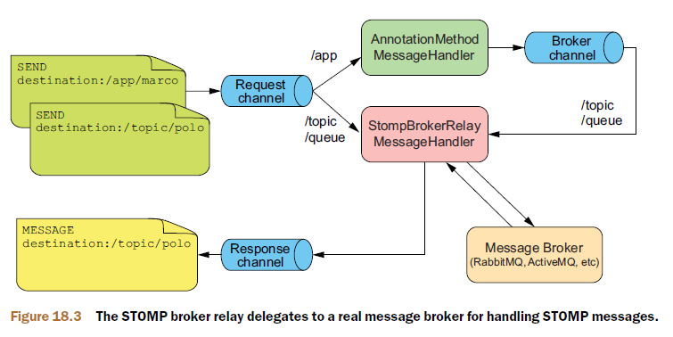
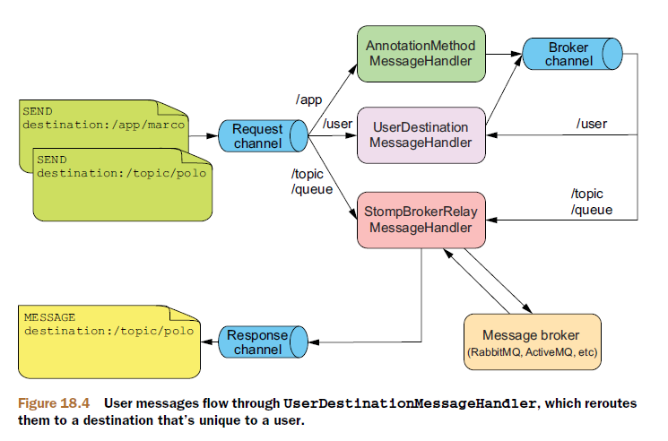

像RMI、HTTP invoker等远程调用机制，以及Web服务、RESTful都是同步通信，而消息则属于异步通信。

在异步消息中有两个主要概念：消息代理（message broker）和目的地（destination）。

当一个应用发送信息时，会将消息交给一个消息代理（相当于邮局）。消息代理可以确保消息被投递到指定的目的地，同时解放发送者，使其能够继续进行其他的业务。

有两种通用的目的地：队列（queue）和主题（topic）。它们分别对应两种消息模型：点对点模型和发布/订阅模型。

# 消息模型

## 点对点模型

在点对点模型中，每一条消息都有一个发送者，并且都只会被一个接收者接收。


尽管消息队列中中的每条消息只会被一个接收者取走，但是并不意味着只能使用一个接收者从队列中获取消息。事实上，通常会有多个接收者来处理队列中的消息。类似于银行排队办理业务一样，银行柜员类似于接收者。

在点对点模型中，如果有多个接收者监听队列，我们是无法知道某条特定消息会由哪一个接收者处理。

## 发布/订阅模型

在发布/订阅模型中，消息会发送给一个主题。与队列类似，多个接收者都可以监听一个主题。但是，与队列不同的是，消息不再是只投递给一个接收者，而是主题的所有订阅者都会接收到此消息的副本。类似于杂志发行商与杂志订阅者。


# JMS

JMS（Java Message Service）是一个Java标准，定义了使用消息代理的通用API。

## 安装消息代理

ActiveMQ是使用JMS进行异步消息传递的最佳选择。

首先，下载并解压发行包；

然后，在`解压目录/bin/指定操作系统子目录/`下，运行`activemq start`来启动ActiveMQ。

另外，要将解压目录下的`activemq-core-x.x.x.jar`添加到应用程序的类路径中，这样在应用程序中就可以使用ActiveMQ的API了。

## 创建连接工厂

应用程序需要借助JMS连接工厂通过消息代理发送消息，所以我们还要配置JMS连接工厂，让它知道如何连接到ActiveMQ。

```xml
<bean id="connectionFactory"
      class="org.apache.activemq.spring.ActiveMQConnectionFactory"
      p:brokerURL="tcp://localhost:60000"/>
```

如果省略`brokerURL`属性，则ActiveMQ代理默认监听`localhost`的61616端口。

另外，也可以使用ActiveMQ自己的Spring配置命名空间来声明连接工厂：

```xml
<?xml version="1.0" encoding="UTF-8"?>
<beans xmlns="http://www.springframework.org/schema/beans"
       xmlns:xsi="http://www.w3.org/2001/XMLSchema-instance"
       xmlns:jms="http://www.springframework.org/schema/jms"
       xmlns:amq="http://activemq.apache.org/schema/core"
       xsi:schemaLocation="http://activemq.apache.org/schema/core
                           http://activemq.apache.org/schema/core/activemq-core.xsd
                           http://www.springframework.org/schema/jms
                           http://www.springframework.org/schema/jms/spring-jms.xsd
                           http://www.springframework.org/schema/beans
                           http://www.springframework.org/schema/beans/spring-beans.xsd">
  <amq:connectionFactory id="connectionFactory"
                         brokerURL="tcp://localhost:61616"/>
  ...
</beans>
```

## 声明消息目的地

消息目的地可以是一个队列，也可以是一个主题，这取决于应用的需求。

### 声明队列

```xml
<bean id="spittleQueue"
      class="org.apache.activemq.command.ActiveMQQueue"
      c:_="spitter.queue" />
```

或者：

```xml
<amq:queue id="spittleQueue" physicalName="spittle.queue" />
```

### 声明主题

```xml
<bean id="spittleTopic"
      class="org.apache.activemq.command.ActiveMQTopic"
      c:_="spitter.topic" />
```

或者：

```xml
<amq:topic id="spittleTopic" physicalName="spittle.topic" />
```

## 使用传统的JMS

### 发送消息

```java
ConnectionFactory cf = new ActiveMQConnectionFactory("tcp://localhost:61616");
Connection conn = null;
Session session = null;
try {
  conn = cf.createConnection();
  session = conn.createSession(false, Session.AUTO_ACKNOWLEDGE);
  Destination destination = new ActiveMQQueue("spitter.queue");
  MessageProducer producer = session.createProducer(destination);
  TextMessage message = session.createTextMessage();
  message.setText("Hello world!");
  producer.send(message);
} catch (JMSException e) {
  // handle exception?
} finally {
  try {
    if (session != null) {
      session.close();
    }
    if (conn != null) {
      conn.close();
    }
  } catch (JMSException ex) {
  }
}
```

### 接收消息

```java
ConnectionFactory cf = new ActiveMQConnectionFactory("tcp://localhost:61616");
Connection conn = null;
Session session = null;
try {
  conn = cf.createConnection();
  conn.start();
  session = conn.createSession(false, Session.AUTO_ACKNOWLEDGE);
  Destination destination = new ActiveMQQueue("spitter.queue");
  MessageConsumer consumer = session.createConsumer(destination);
  Message message = consumer.receive();
  TextMessage textMessage = (TextMessage) message;
  System.out.println("GOT A MESSAGE: " + textMessage.getText());
  conn.start();
} catch (JMSException e) {
  // handle exception?
} finally {
  try {
    if (session != null) {
      session.close();
    }
    if (conn != null) {
      conn.close();
    }
  } catch (JMSException ex) {
  }
}
```

## 使用JmsTemplate

### 注册JmsTemplate Bean

```xml
<bean id="jmsTemplate"
      class="org.springframework.jms.core.JmsTemplate"
      c:_-ref="connectionFactory" />
```

#### 设置默认目的地

如果总是将消息发送给或接收自相同的目的地，则可以为`JmsTempate`装配一个默认的目的地。这样，每次发送或接收消息时就不需要指定一个目的地了：

```xml
<bean id="jmsTemplate"
      class="org.springframework.jms.core.JmsTemplate"
      c:_-ref="connectionFactory"
      p:defaultDestinationName="spittle.queue" />
```

`defaultDestinationName`属性只是指定了一个目的地的名称，它没有说明目的地是什么类型。如果已经存在该名称的队列或主题，就会使用已有的。否则，将会创建一个新的目的地（通常会是队列）。

如果想指定要创建的目的地类型，则需要使用`defaultDestination-ref`属性将之前创建的队列或主题的目的地Bean装配进来：

```xml
<bean id="jmsTemplate"
      class="org.springframework.jms.core.JmsTemplate"
      c:_-ref="connectionFactory"
      p:defaultDestination-ref="spittleTopic" />
```

现在调用`JmsTempate`的`send`方法时，我们可以省略目的地参数：

```java
jmsOperations.send(
  new MessageCreator() {
    ...
  }
);
```

### 发送消息

```java
public interface AlertService {
	void sendSpittleAlert(Spittle spittle);
}

public class AlertServiceImpl implements AlertService {
  private JmsOperations jmsOperations;
  @Autowired
  public AlertServiceImpl(JmsOperations jmsOperatons) {
    this.jmsOperations = jmsOperations;
  }
  public void sendSpittleAlert(final Spittle spittle) {
    jmsOperations.send(
      "spittle.queue",  //指定目的地
      new MessageCreator() {
        public Message createMessage(Session session) throws JMSException {
          return session.createObjectMessage(spittle); //创建消息
        }
      }
    );
  }
}
```

`JmsOperation`是`JmsTemplate`所实现的接口。


#### 对消息进行转换

除了`send`方法外，`JmsTemplate`还提供了`convertAndSend`方法，它不需要`MessageCreator`作为参数，而是使用内置的消息转换器为我们创建消息，然后发送消息。

```java
public void sendSpittleAlert(Spittle spittle) {
  jmsOperations.convertAndSend(spittle);
}
```

Spring提供的消息转换器：

| 消息转换器                      | 功能                                                         |
| ------------------------------- | ------------------------------------------------------------ |
| MappingJacksonMessageConverter  | 使用Jackson JSON库实现消息与JSON格式之间的相互转换。         |
| MappingJackson2MessageConverter | 使用Jackson 2 JSON库实现消息与JSON格式之间的相互转换。       |
| MarshallingMessageConverter     | 使用JAXB库实现消息与XML格式之间的相互转换。                  |
| SimpleMessageConverter          | 实现`String`与`TextMessage`之间，字节数组与`BytesMessage`，`Map`与`MapMessage`之间，`Serializable`对象与`ObjectMessage`之间的相互转换。 |

默认情况下，`JmsTemplate`在`convertAndSend`方法中使用`SimpleMessageConverter`。如果要自己指定消息转换器，则首先声明一个消息转换器Bean，例如：

```xml
<bean id="messageConverter"
  class="org.springframework.jms.support.converter.MappingJacksonMessageConverter" />
```

> 各个消息转换器可能会需要配置一些额外的属性。

然后，将其注入到`JmsTemplate` Bean中：

```xml
<bean id="jmsTemplate"
      class="org.springframework.jms.core.JmsTemplate"
      c:_-ref="connectionFactory"
      p:defaultDestinationName="spittle.alert.queue"
      p:messageConverter-ref="messageConverter" />
```

如果内置的消息转换器满足不了需求，则可以自己实现消息转换器，然后将其注入到`JmsTemplate` Bean中。自定义的消息转换器要实现`MessageConverter`接口。

### 接收消息

#### 同步接收

```java
public Spittle receiveSpittleAlert() {
  try {
    ObjectMessage receivedMessage =
      (ObjectMessage) jmsOperations.receive(); //从默认目的地接收消息
    return (Spittle) receivedMessage.getObject();
  } catch (JMSException jmsException) { //由gerObject()抛出
    throw JmsUtils.convertJmsAccessException(jmsException); //抛出转换后的非检查型异常
  }
}
```


`receive`方法会尝试从消息代理中获取一条消息，如果没有可用的消息，它会一直等待，直到获得消息（或超时）为止。

`JmsTemplate`只能处理自己方法抛出的`JMSException`异常，它无法处理`ObjectMessage`的`getObject`方法所抛出的`JMSException`异常。因此，我们要么捕获`JMSException`异常，要么声明抛出`JMSException`异常。这里，使用Spring中JmsUtils的`convertJmsAccessException`方法把检查型异常`JMSException`转换为非检查型异常`JmsException`。

同步接收消息也可以使用消息转换器，也就是使用`JmsTemplate`的`receiveAndConvert`方法。

```java
public Spittle retrieveSpittleAlert() {
	return (Spittle) jmsOperations.receiveAndConvert();
}
```

现在没有必要将`Message`转换为`ObjectMessage`，也没有必要通过调用`getObject`方法来获取`Spittle`，更无需担心检查型异常`JMSException`。

使用`JmsTemplate`接收消息的最大缺点在于`receive`方法和`receiveAndConvert`方法都是同步的，它们会一直阻塞，直到有可用消息（或者直到超时）。

## 使用消息驱动POJO：异步接收

### 创建消息监听器

Spring的消息监听器类就是一个POJO：

```java
public class SpittleAlertHandler {
  public void handleSpittleAlert(Spittle spittle) { //处理方法
    // ... implementation goes here...
  }
}
```

### 配置消息监听器

首先，将上面创建的消息监听器类配置成Bean：

```xml
<bean id="spittleHandler"
      class="com.habuma.spittr.alerts.SpittleAlertHandler" />
```

然后，把这个Bean注册为消息监听器：

```xml
<jms:listener-container connection-factory="connectionFactory">
  <jms:listener destination="spitter.queue"
                ref="spittleHandler" method="handleSpittleAlert" />
</jms:listener-container>
```

消息监听器容器是一个特殊Bean，它可以监控JMS目的地并等待消息到达。一旦有消息到达，它取出消息，然后把消息传给任意一个对此消息感兴趣的消息监听器。


`connection-factory`属性配置了对`connectionFactory`的引用，容器中每个消息监听器都使用这个连接工厂进行消息监听。在本例中，`connection-factory`属性可以移除，因为该属性的默认值就是`connectionFactory`。

另外，如果`ref`引用的Bean实现了`MessageListener`接口，则`method`属性也可移除，这时默认就是`onMessage`方法。

## 使用基于消息的RPC

现在我们将了解一下如何使用JMS作为传输通道来进行远程调用。

为了支持基于消息的RPC，Spring提供了`JmsInvokerServiceExporter`，它可以把Bean导出为基于消息的服务；为客户端提供了`JmsInvokerProxyFactoryBean`来使用这些服务。

### 导出基于JMS的服务

要导出的服务：

```java
public interface AlertService {
	void sendSpittleAlert(Spittle spittle);
}

@Component("alertService")
public class AlertServiceImpl implements AlertService {
  private JavaMailSender mailSender;
  private String alertEmailAddress;
  public AlertServiceImpl(JavaMailSender mailSender,
                          String alertEmailAddress) {
    this.mailSender = mailSender;
    this.alertEmailAddress = alertEmailAddress;
  }
  public void sendSpittleAlert(final Spittle spittle) {
    SimpleMailMessage message = new SimpleMailMessage();
    String spitterName = spittle.getSpitter().getFullName();
    message.setFrom("noreply@spitter.com");
    message.setTo(alertEmailAddress);
    message.setSubject("New spittle from " + spitterName);
    message.setText(spitterName + " says: " + spittle.getText());
    mailSender.send(message);
  }
}
```

配置`JmsInvokerServiceExporter`：

```xml
<bean id="alertServiceExporter"
      class="org.springframework.jms.remoting.JmsInvokerServiceExporter"
      p:service-ref="alertService"
      p:serviceInterface="com.habuma.spittr.alerts.AlertService" />
```

`JmsInvokerServiceExporter`可以充当JMS监听器，因此，我们使用`<jms:listener-container>`配置它：

```xml
<jms:listener-container connection-factory="connectionFactory">
  <jms:listener destination="spitter.queue"
                ref="alertServiceExporter" />
</jms:listener-container>
```

这样，基于JMS的服务就准备好了，它将等待`spitter.queue`队列中RPC消息的到达。

### 使用基于JMS的服务

在客户端配置`JmsInvokerProxyFactoryBean`代理来访问JMS服务：

```xml
<bean id="alertService"
      class="org.springframework.jms.remoting.JmsInvokerProxyFactoryBean"
      p:connectionFactory-ref="connectionFactory"
      p:queueName="spittle.queue"
      propp:serviceInterface="com.habuma.spittr.alerts.AlertService" />
```

# AMQP

与JMS不同，AMQP的生产者并不会直接将消息发布到队列中，AMQP在消息的生产者和传递信息的队列之间引入了一种间接的机制：Exchange。消息生产者将信息发布到一个Exchange，Exchange会绑定到一个或多个队列上，它负责将信息路由到队列上。


AMQP定义了四种不同类型的Exchange：

- Direct：如果消息的routing key与binding的routing key直接匹配的话，消息将会路由到该队列上；
- Topic：如果消息的routing key与binding的routing key符合通配符匹配，则消息将会路由到该队列上；
- Headers：如果消息参数表中的头信息和值都与binding参数表中相匹配，则消息将会路由到该队列上；
- Fanout：不管消息的routing key和参数表中的头信息/值是什么，消息将会路由到所有队列上。

另外，Exchange可以绑定到另一个Exchange上。

## 创建连接工厂

```xml
<?xml version="1.0" encoding="UTF-8"?>
<beans:beans xmlns="http://www.springframework.org/schema/rabbit"
             xmlns:beans="http://www.springframework.org/schema/beans"
             xmlns:xsi="http://www.w3.org/2001/XMLSchema-instance"
             xsi:schemaLocation="http://www.springframework.org/schema/rabbit
                                 http://www.springframework.org/schema/rabbit/spring-rabbit-1.0.xsd
                                 http://www.springframework.org/schema/beans
                                 http://www.springframework.org/schema/beans/spring-beans.xsd">
  <connection-factory id="connectionFactory"
                      host="${rabbitmq.host}"
                      port="${rabbitmq.port}"
                      username="${rabbitmq.username}"
                      password="${rabbitmq.password}" />
  ...
</beans:beans>
```

`host`、`port`、`username`和`password`都是可选，如果省略，则RabbitMQ默认监听`localhost`的5672端口，并且用户名和密码均为`guest`。

## 声明队列、Exchange以及binding

在JMS中，队列和主题的路由行为都是通过规范建立的，而AMQP则不同，它的路由方式可通过队列、Exchange以及binding的各种组合实现。

例如：点对点模型

```xml
<admin connection-factory="connectionFactory" />
<queue id="spittleAlertQueue" name="spittle.alerts" />
```

这里会有一个默认的没有名称的Direct Exchange，所有队列都会绑定到这个Exchange上，并且routing key与队列的名称相同。

更复杂的例子：

```xml
<admin connection-factory="connectionFactory" />
<queue name="spittle.alert.queue.1" />
<queue name="spittle.alert.queue.2" />
<queue name="spittle.alert.queue.3" />
<fanoutexchange name="spittle.fanout">
  <bindings>
    <binding queue="spittle.alert.queue.1" />
    <binding queue="spittle.alert.queue.2" />
    <binding queue="spittle.alert.queue.3" />
  </bindings>
</fanoutexchange>
```

## 发送消息

### 注册RabbitTemplate

```xml
<template id="rabbitTemplate" connection-factory="connectionFactory" />
```

### 使用convertAndSend方法发送消息

```java
public class AlertServiceImpl implements AlertService {
  private RabbitTemplate rabbit;
  @Autowired
  public AlertServiceImpl(RabbitTemplate rabbit) {
    this.rabbit = rabbit;
  }
  public void sendSpittleAlert(Spittle spittle) {
    rabbit.convertAndSend("spittle.alert.exchange", //Exchange名称
                          "spittle.alerts",  //routing key
                          spittle);  //发送的对象
  }
}
```

另外，如果在`<template`上使用`exchange`和`routing-key`属性配置默认的Exchange名称和routint key，则在调用`convertAndSend`方法时，可以省略前两个参数：

```xml
<template id="rabbitTemplate"
          connection-factory="connectionFactory"
          exchange="spittle.alert.exchange"
          routing-key="spittle.alerts" />
```

则：

```java
rabbit.convertAndSend(spittle);
```

最后，如果在`<template>`和`convertAndSend`方法中均未指定Exchange名称和routing key，则Exchange名称和routing key均默认为空。

通过`convertAndSend`方法指定的Exchange名称和routing key，将覆盖`<template>`的相应配置。

`convertAndSend`方法会自动将对象转换为`Message`对象。它需要借助一个消息转换器来完成该转换，默认的消息转换器是`SimpleMessageConverter`，它适用于`String`、`Serializable`实例以及字节数组。

### 使用send方法发送消息

我们还可以使用较低级的`send`方法来直接发送`org.springframework.amqp.core.Message`对象：

```java
Message helloMessage =
  new Message("Hello World!".getBytes(), new MessageProperties());
rabbit.send("hello.exchange", "hello.routing", helloMessage);
```

## 接收消息

### 使用RabbitTemplate来同步接收消息

#### 注册RabbitTemplate

```xml
<template id="rabbitTemplate"
          connection-factory="connectionFactory"
          exchange="spittle.alert.exchange"
          routing-key="spittle.alerts"
          queue="spittle.alert.queue" />
```

#### 使用receive方法接收消息

```java
Message message = rabbit.receive();
```

`receive`方法的其他重载版本可以显式指定Exchange名称和routing key来覆盖`<tempate>`中的配置。

```java
Message message = rabbit.receive("spittle.alert.queue2");
```

#### 使用receiveAndConvert方法接收消息

`receiveAndConvert`方法会使用与`sendAndConvert`方法相同的消息转换器，来将`Message`对象转换为原始的类型。

```java
Spittle spittle = (Spittle) rabbit.receiveAndConvert();
```

#### 管理轮询

调用`receive`和`receiveAndConvert`方法都会立即返回。如果队列中没有等待的消息时，将会得到`null`。这就需要我们来管理轮询（polling）以及必要的线程，实现队列的监控。

### 使用消息驱动的POJO来异步接收消息

我们并非必须同步轮询并等待消息到达，Spring AMQP还提供了消息驱动POJO的支持。

#### 创建消息监听器POJO类

我们可以完全重用JMS的消息监听器POJO类——`SpittleAlertHandler`，因为它丝毫没有依赖于JMS或AMQP。

```java
public class SpittleAlertHandler {
  public void handleSpittleAlert(Spittle spittle) {
    // ... implementation goes here ...
  }
}
```

#### 配置消息监听器

首先，将上面创建的消息监听器类配置成Bean（与配置JMS消息监听器完全相同）：

```xml
<bean id="spittleListener"
      class="com.habuma.spittr.alert.SpittleAlertHandler" />
```

然后，把这个Bean注册为消息监听器：

```xml
<rabbit:listener-container connection-factory="connectionFactory">
  <rabbit:listener ref="spittleListener"
                   method="handleSpittleAlert"
                   queue-names="spittle.alert.queue" />
</rabbit:listener-container>
```

`queue-names`可以设置多个队列的名称，用逗号分割。

另外，还可以使用`queues`属性来引用一个或多个（用逗号分割）使用`<queue>`元素声明要监听的队列Bean。

```xml
<listener-container connection-factory="connectionFactory">
  <listener ref="spittleListener"
            method="handleSpittleAlert"
            queues="spittleAlertQueue" />
</listener-container>

<queue id="spittleAlertQueue" name="spittle.alert.queue" />
```

# WebSocket

JMS和AMQP是用于应用程序之间的通讯，而如果某个应用是运行在Web浏览器中，则就需要使用WebSocket。

WebSocket协议提供了通过一个套接字实现全双工通信（服务器和浏览器可以互相发送消息）的功能，位于WebSocket一端的应用发送消息，另一端处理消息。因为它是全双工的，所以每一端都可以发送和处理消息。


WebSocket通信可以应用于任何类型的应用中，但是它最常见的应用场景是实现Web浏览器和服务器之间的异步通信。浏览器中的JavaScript客户端开启一个到服务器的连接，服务器通过这个连接发送更新给浏览器。相比历史上轮询服务端以查找更新的方案，这种技术更加高效和自然。

## 使用Spring的低层级WebSocket API

### 创建消息处理器

WebSocket消息处理器是一个实现了`WebSocketHandler`接口的类。

`WebSocketHandler`接口：

```java
public interface WebSocketHandler {
  void afterConnectionEstablished(WebSocketSession session) 
    throws Exception;
  void handleMessage(WebSocketSession session, WebSocketMessage<?> message) 
    throws Exception;
  void handleTransportError(WebSocketSession session, Throwable exception) 
    throws Exception;
  void afterConnectionClosed(WebSocketSession session, CloseStatus closeStatus) 
    throws Exception;
  boolean supportsPartialMessages();
}
```

通常，创建消息处理器更简便的方法是扩展`AbstractWebSocketHandler`抽象类：

```java
public class MarcoHandler extends AbstractWebSocketHandler {
  private static final Logger logger = LoggerFactory.getLogger(MarcoHandler.class);
  protected void handleTextMessage(WebSocketSession session, TextMessage message) 
    	throws Exception {
    logger.info("Received message: " + message.getPayload());
    Thread.sleep(2000); //模拟延时
    session.sendMessage(new TextMessage("Polo!")); //发送文本消息
  }
}
```

`AbstractWebSocketHandler`额外定义了三个方法：

- handleBinaryMessage()
- handlePongMessage()
- handleTextMessage()

这三个方法只是`handleMessage()`的具体化，每个方法对应于某一种特定类型的消息。

如果只是处理文本消息，则可扩展`TextWebSocketHandler`类。

### 启用WebSocket

启用WebSocket并注册消息处理器：

```java
@EnableWebSocket
public class WebSocketConfig implements WebSocketConfigurer {
  @Override
  public void registerWebSocketHandlers(WebSocketHandlerRegistry registry) {
    registry.addHandler(marcoHandler(), "/marco"); //将MarcoHandler映射到“/marco”
  }
  @Bean
  public MarcoHandler marcoHandler() {
    return new MarcoHandler();
  }
}
```

或者：

```xml
<?xml version="1.0" encoding="UTF-8"?>
<beans xmlns="http://www.springframework.org/schema/beans"
       xmlns:xsi="http://www.w3.org/2001/XMLSchema-instance"
       xmlns:websocket="http://www.springframework.org/schema/websocket"
       xsi:schemaLocation="
         http://www.springframework.org/schema/websocket
         http://www.springframework.org/schema/websocket/spring-websocket.xsd
         http://www.springframework.org/schema/beans
         http://www.springframework.org/schema/beans/spring-beans.xsd">
  <websocket:handlers>
    <websocket:mapping handler="marcoHandler" path="/marco" />
  </websocket:handlers>
  <bean id="marcoHandler"
        class="marcopolo.MarcoHandler" />
</beans>
```

### JavaScript客户端

```javascript
var url = 'ws://' + window.location.host + '/websocket/marco';
var sock = new WebSocket(url); //打开WebSocket
sock.onopen = function() { //处理连接开启事件
  console.log('Opening');
  sayMarco();
};
sock.onmessage = function(e) { //处理消息
  console.log('Received message: ', e.data);
  setTimeout(function(){sayMarco()}, 2000);
};
sock.onclose = function() { //处理连接关闭事件
  console.log('Closing');
};
function sayMarco() {
  console.log('Sending Marco!');
  sock.send("Marco!"); //发送消息
}
```

URL使用了`ws://`前缀，表明这是一个基本的WebSocket连接。如果是安全WebSocket，则使用`wss://`前缀。

### 关闭WebSocket连接

下列三种场景均可关闭WebSocket连接：

- 客户端调用`sock.close()`；
- 服务器端调用`session.close()`；
- 浏览器转向其他页面。

## 应对不支持WebSocket的场景——SockJS

当前不支持WebSocket场景主要由下列三种原因造成：

- 某些浏览器不支持WebSocket；
- 某些应用服务器不支持WebSocket；
- 防火墙限制了WebSocket通信。

SockJS是WebSocket技术的一种模拟，在表面上，它尽可能对应WebSocket API，但是在底层它非常智能。SockJS会优先选用WebSocket，但是如果WebSocket不可用，则它会从如下方案中挑选最优的可行方案：

- XHR流
- XDR流
- iFrame事件源
- iFrame HTML文件
- XHR轮询
- XDR轮询
- iFrame XHR轮询
- JSONP轮询

### 在服务端启用SockJS

```java
@Override
public void registerWebSocketHandlers(WebSocketHandlerRegistry registry) {
	registry.addHandler(marcoHandler(), "/marco").withSockJS();
}
```

通过简单地调用`withSockJS`方法，就能声明我们想要使用的SockJS功能，如果WebSocket不可用，则SockJS的备用方案就会发挥作用。

或者使用XML来配置：

```xml
<websocket:handlers>
  <websocket:mapping handler="marcoHandler" path="/marco" />
  <websocket:sockjs />
</websocket:handlers>
```

### 在客户端启用SockJS

#### 加载SockJS客户端库

```html
<script src="http://cdn.sockjs.org/sockjs-0.3.min.js"></script>
```

#### 编写客户端代码

只需要在原来基于WebSocket API的代码上修改两行代码就可以使用SockJS：

```javascript
var url = 'marco';
var sock = new SockJS(url);
```

第一个修改就是URL。SockJS所处理的URL是`http://`或`https://`模式，而不是`ws://`或`wss://`。而且可以使用相对URL，如果包含JavaScript的页面位于http://localhost:8080/websocket ，则本例给定的相对路径`marco`将对应于http://localhost:8080/websocket/marco。

第二个修改是创建SockJS实例代替WebSocket。

## 使用STOMP消息

直接使用WebSocket（或SockJS）就类似于使用TCP套接字来编写Web应用，显得过于低级。因为没有高层级的线路协议（wire protocol），因此就需要我们定义应用之间所发送消息的语义，还需要确保连接的两端都能遵循这些语义。

STOMP在WebSocket之上提供了一个基于帧的线路格式（frame-based wire format）层，用来定义消息的语义。

相比于使用原始的WebSocket，使用STOMP能够带来以下好处：

- 无需发明自定义消息传递协议和消息格式。
- 有可用的STOMP客户端，包括Spring Framework中的Java客户端。
- 您可以（可选）使用现成的消息代理（例如RabbitMQ，ActiveMQ等）来管理订阅和广播消息。
- 可以在任意数量的`@Controller`实例中组织应用程序逻辑，并且可以基于STOMP `destination`头将消息路由到它们，而无须使用给定连接的单个`WebSocketHandler`来处理原始WebSocket消息。
- 您可以使用Spring Security根据STOMP`destination`和消息类型来保护消息。

STOMP帧在HTTP上建模，由命令、一个或多个头信息以及负载（payloads）所组成，非常类似于HTTP请求结构：

```
COMMAND
header1:value1
header2:value2

Body^@
```

例如：客户端发送消息的STOMP帧

```
SEND
destination:/app/marco
content-length:20

{\"message\":\"Marco!\"}^@
```

客户端订阅消息的STOMP帧：

```
SUBSCRIBE
id:sub-1
destination:/topic/price.stock.*

^@
```

STOMP服务器广播消息的STOMP帧：（STOMP服务器可以使用MESSAGE命令向所有订阅客户端广播消息）

```
MESSAGE
message-id:nxahklf6-1
subscription:sub-1
destination:/topic/price.stock.MMM

{"ticker":"MMM","price":129.45}^@
```

> 服务器无法发送未经请求的消息给客户端。也就是说，所有来自服务器的消息都必须响应特定的客户端订阅，并且服务器消息的subscription头必须与客户端订阅的id头匹配。

尽管STOMP是一种面向文本的协议，但消息负载可以是文本或二进制。

Spring为STOMP消息提供了基于Spring MVC的编程模型，在Spring MVC控制器中处理STOMP消息与处理HTTP请求并没有太大的差别。

### 启用STOMP消息功能

spring-messaging和spring-websocket模块提供WebSocket之上的STOMP 支持。一旦有了这些依赖项，就可以通过[SockJS Fallback](https://docs.spring.io/spring/docs/5.1.3.RELEASE/spring-framework-reference/web.html#websocket-fallback)在WebSocket上公开STOMP端点。

```java
@Configuration
@EnableWebSocketMessageBroker
public class WebSocketStompConfig extends AbstractWebSocketMessageBrokerConfigurer {
  @Override
  public void registerStompEndpoints(StompEndpointRegistry registry) {
    //将“/marcopolo”注册为STOMP端点，客户端在订阅或发布消息到目的地路径前，要连接该端点。
    registry.addEndpoint("/marcopolo").withSockJS();
  }
  @Override
  public void configureMessageBroker(MessageBrokerRegistry registry) {
    //使用内置消息代理进行订阅和广播，并将destination头以“/topic”或“/queue”开头的消息路由到代理。
    registry.enableSimpleBroker("/queue", "/topic");
    //destination头以“/app”为前缀的STOMP消息将路由到@Controller类中的@MessageMapping方法。
    registry.setApplicationDestinationPrefixes("/app");
  }
}
```

> 如果没有重写`configureMessageBroker`方法，则会自动配置一个简单的内存消息代理，用它来处理以`/topic`前缀的消息。只有需要显式配置一个消息代理时，才需要重写这个方法。

或者：

```xml
<beans xmlns="http://www.springframework.org/schema/beans"
       xmlns:xsi="http://www.w3.org/2001/XMLSchema-instance"
       xmlns:websocket="http://www.springframework.org/schema/websocket"
       xsi:schemaLocation="
         http://www.springframework.org/schema/beans
         http://www.springframework.org/schema/beans/spring-beans.xsd
         http://www.springframework.org/schema/websocket
         http://www.springframework.org/schema/websocket/spring-websocket.xsd">
  <websocket:message-broker application-destination-prefix="/app">
    <websocket:stomp-endpoint path="/marcopolo">
      <websocket:sockjs/>
    </websocket:stomp-endpoint>
    <websocket:simple-broker prefix="/queue, /topic"/>
  </websocket:message-broker>
</beans>
```




> 图中的三个消息通道如下：
>
> - clientInboundChannel：用于传递从WebSocket客户端接收到的消息。
> - clientOutboundChannel：用于将服务器消息发送到WebSocket客户端。
> - brokerChannel：用于从服务器端应用程序代码中向消息代理发送消息。
>
> 注意：向clientInboundChannel发送请求消息的客户端，与从clientOutboundChannel订阅响应消息的客户端并不一定是同一个客户端。而且，订阅响应消息的客户端有可能有多个。

#### 启用STOMP代理中继

简单的代理是基于内存的，尽管它模拟了STOMP消息代理，但是它只支持STOMP命令的子集，并且它不适合集群环境。在生产环境中，我们会使用真正支持STOMP的代理（例如RabbitMQ或ActiveMQ）来支撑WebSocket消息。



首先，根据相关文档搭建STOMP代理。（略）

然后，按如下方式重载`configureMessageBroker`方法：

```java
@Override
public void configureMessageBroker(MessageBrokerRegistry registry) {
  registry.enableStompBrokerRelay("/topic", "/queue");
  registry.setApplicationDestinationPrefixes("/app");
}
```

这里，`destination`头以“/topic”或“/queue”开头的消息都会发送到STOMP代理中。根据所选择的STOMP代理不同，`destination`头的可选前缀也会有所限制。例如，RabbitMQ只允许`destination`头以`/temp-queue`、`/exchange`、`/topic`、`/queue`、`/amq/queue`和`/reply-queue`。

默认情况下，STOMP代理中继会假设代理监听`localhost`的61613端口，并且客户端的`username`和`password`均为`guest`。如果需要自己指定这些信息，则：

```java
@Override
public void configureMessageBroker(MessageBrokerRegistry registry) {
  registry.enableStompBrokerRelay("/topic", "/queue")
    .setRelayHost("rabbit.someotherserver")
    .setRelayPort(62623)
    .setClientLogin("marcopolo")
    .setClientPasscode("letmein01");
  registry.setApplicationDestinationPrefixes("/app", "/foo");
}
```

### 编写JavaScript客户端

要从浏览器连接，对于SockJS，您可以使用[sockjs-client](https://github.com/sockjs/sockjs-client)。对于STOMP，许多应用程序使用了[jmesnil/stomp-websocket](jmesnil/stomp-websocket)库（也称为stomp.js），它是功能完备的，已经在生产中使用多年但不再维护。目前，[JSteunou/webstomp-client](JSteunou/webstomp-client)是该库中最积极维护和不断发展的继任者。

下面的示例代码基于webstomp-client：

```javascript
var url = '/' + window.location.host + '/stomp/marcopolo'; //这里“/stomp”是应用上下文路径
var socket = new SockJS(url); //创建SockJS连接
var stompClient = webstomp.over(socket); //创建STOMP客户端

stompClient.connect({}, function(frame) { //连接STOMP端点
  …
}
```

或者，如果通过WebSocket连接（没有SockJS），则可以使用以下代码：

```javascript
var url = '/' + window.location.host + '/stomp/marcopolo';
var socket = new WebSocket(url);
var stompClient = Stomp.over(socket);

stompClient.connect({}, function(frame) {
  …
}
```

#### 发送消息

可以使用`stompClient.send`方法来向服务端发送STOMP消息（`SEND`帧）。

##### 发往控制器方法

在我们的例子中，`destination`头以`/app`为前缀的`SEND`帧将被路由到`@MessageMapping`方法或`@SubscribeMapping`方法进行处理。

```javascript
var payload = JSON.stringify({'message': 'Marco!'});
stompClient.send("/app/marco", payload);
```

##### 发往代理

在我们的例子中，`destination`头以“/topic”或“/queue”开头的消息都会发送到STOMP代理中存储。

```javascript
stompClient.send("/topic/marco", payload);
```

#### 订阅消息

### 处理来自客户端的STOMP消息

当从WebSocket连接接收客户端发来的STOMP消息时，它们被解码为STOMP帧，然后转换成Spring的 `Message`对象，并发送到clientInboundChannel以进行进一步处理。例如，destination 头以`/app`开头的STOMP消息可以路由到控制器中的`@MessageMapping`方法或`@SubscribeMapping`方法，而以`/topic`和`/queue`开头的消息可以直接路由到消息代理。

带有`@Controller`标注的控制器可以用来处理来自客户端的destination 头以`/app`开头的STOMP消息（`SEND`帧）。并且，如果控制器处理方法有返回值，还会通过brokerChannel向代理发送消息。随后，代理通过clientOutboundChannel将消息广播给匹配的订户。

#### `@MessageMapping`方法

`@MessageMapping`可用在方法级别或类型级别。在类型级别，`@MessageMapping`用于表示控制器中所有方法的共享映射。

`@MessageMapping`支持的路径模式与`@RequestMapping`相同。

```java
@Controller
public class MarcoController {
  private static final Logger logger =
    LoggerFactory.getLogger(MarcoController.class);
  @MessageMapping("/marco")
  public void handleShout(Shout incoming) {
    logger.info("Received message: " + incoming.getMessage());
  }
}
```

上面处理器将接收destination 头为`/app/marco`的STOMP消息（“/app”前缀是隐含的，因为我们将其配置为应用的目的地前缀——`registry.setApplicationDestinationPrefixes("/app")`。）

这里处理器方法接收一个`Shout`参数，所以Spring会使用消息转换器将STOMP消息的负载转换为`Shout`对象。

```java
public class Shout {
  private String message;
  public String getMessage() {
    return message;
  }
  public void setMessage(String message) {
    this.message = message;
  }
}
```

#### `@SubscribeMapping`方法

`@SubscribeMapping`类似于`@MessageMapping`也是处理`destination` 头以`/app`开头的STOMP消息（`SEND`帧）。

`@SubscribeMapping`只能用在方法级别上，但是，它可以与用在类型级别的`@MessageMapping`结合使用。

`@SubscribeMapping`与`@MessageMapping`区别在于：`@SubscribeMapping`方法的返回值，默认情况下，将作为消息**直接发送回连接的客户端**，而不通过代理。而`@MessageMapping`方法如果有返回值，则是将返回值作为消息通过代理广播给订阅者。

```java
@SubscribeMapping({"/marco"})
public Shout handleSubscription() {
  Shout outgoing = new Shout();
  outgoing.setMessage("Polo!");
  return outgoing;
}
```

`@SubscribeMapping`的主要应用场景是实现“请求-响应”模式，并且它是异步的，这不同于HTTP GET的同步式的“请求-响应”模式。

#### 消息处理器方法参数

`@SubscribeMapping`方法、`@MessageMapping`方法，以及`@MessageExceptionHandler`方法的参数：

- `Message`：用于访问正在处理的完整消息。
- `MessageHeaders`：用于访问所有消息头。
- `MessageHeaderAccessor`、`SimpMessageHeaderAccessor`、`StompHeaderAccessor`：通过类型化访问器方法访问消息头。
- `@Payload`：用于访问消息的有效负载，由已配置的`MessageConverter`转换。如果方法只有一个参数，则默认就是该参数，这时标注可省略。
- `@Header`：用于访问特定的头值。
- `@Headers`：用于访问消息中的所有头。此参数必须是`java.util.Map`。
- `@DestinationVariable`：用于访问从消息destination中提取的模板变量。根据需要将值转换为声明的方法参数类型。
- `java.security.Principal`：反映WebSocket HTTP握手时登录的用户。

#### 消息负载转换器

因为我们现在处理的不是HTTP，所以无法使用Spring的`HttpMessageConverter`实现将负载转换为`Shout`对象。Spring 4.0提供了几个消息转换器用于将消息负载转换为Java对象：

| 消息转换器                      | 说明                                                         |
| ------------------------------- | ------------------------------------------------------------ |
| ByteArrayMessageConverter       | 实现MIME类型`application/octet-stream`的消息与`byte[]`之间的相互转换。 |
| MappingJackson2MessageConverter | 实现MIME类型`application/json`的消息与Java对象之间的相互转换。 |
| StringMessageConverter          | 实现MIME类型`text/plain`的消息与`String`之间的相互转换。     |

### 向客户端发送消息

#### 在处理消息之后发送消息

`@SubscribeMapping`方法与`@MessageMapping`方法如果没有返回值（即`void`），则它们的任务只是处理消息，并不需要给客户端回应。如果想要在接收消息的时候，同时在响应中发送一条消息，则只需要将响应内容通过返回值返回。

`@MessageMapping`方法：

```java
@MessageMapping("/marco")
public Shout handleShout(Shout incoming) {
  logger.info("Received message: " + incoming.getMessage());
  Shout outgoing = new Shout();
  outgoing.setMessage("Polo!");
  return outgoing;
}
```

`@SubscribeMapping`方法：

```java
@SubscribeMapping("/marco")
public Shout handleSubscription() {
  Shout outgoing = new Shout();
  outgoing.setMessage("Polo!");
  return outgoing;
}
```

`handleShout`方法接收`destination` 头为`/app/marco`的消息，然后将返回的对象转换为STOMP帧通过brokerChannel发往目的地`/topic/marco`。

`handleSubscription`方法也接收`destination` 头为`/app/marco`的消息，但由于它标有`@SubscribeMapping`，因此，它将返回对象进行转换并直接发送回客户端，而不通过消息代理。

##### 重载目的地

`@SubscribeMapping`方法与`@MessageMapping`方法都可以通过`@SendTo`标注重载通过返回值响应的消息的目的地：

```java
@MessageMapping("/marco")
@SendTo("/topic/shout")
public Shout handleShout(Shout incoming) {
  logger.info("Received message: " + incoming.getMessage());
  Shout outgoing = new Shout();
  outgoing.setMessage("Polo!");
  return outgoing;
}
```

`handleShout`方法通过`@SendTo`标注将消息目的地重载为`/topic/shout`（默认是`/topic/marco`）。

通过`@SendTo`标注重载目的地后，`@SubscribeMapping`方法也将返回的对象转换为STOMP帧通过brokerChannel发往目的地`/topic/marco`，而不是直接发送回客户端。

#### 在应用的任意地方发送消息

Spring的`SimpMessagingTemplate`能够在应用的任何地方通过消息代理（经过clientInboundChannel，而不是brokerChannel）发送消息给客户端，甚至不必以首先接收一条消息作为前提。

例如，为了在Spittr首页提供实时的Spittle feed功能，可以在首页订阅一个STOMP主题，当`Spittle`创建时，该主题能够收到`Spittle`更新的实时feed。

在首页添加如下JavaScript代码：

```javascript
<script>
var sock = new SockJS('spittr');
var stomp = webstomp.over(sock);
stomp.connect('guest', 'guest', function(frame) {
  console.log('Connected');
  stomp.subscribe("/topic/spittlefeed", handleSpittle);
});
function handleSpittle(incoming) {
  var spittle = JSON.parse(incoming.body);
  console.log('Received: ', spittle);
  var source = $("#spittle-template").html();
  var template = Handlebars.compile(source);
  var spittleHtml = template(spittle);
  $('.spittleList').prepend(spittleHtml);
}
</script>
```

Handlebars模板定义在另一个单独的`<script>`中：

```html
<script id="spittle-template" type="text/x-handlebars-template">
  <li id="preexist">
    <div class="spittleMessage">{{message}}</div>
    <div>
      <span class="spittleTime">{{time}}</span>
      <span class="spittleLocation">({{latitude}}, {{longitude}})</span>
    </div>
  </li>
</script>
```

在服务端，我们可以使用`SimpMessagingTemplate`将所有新创建的`Spittle`以消息的形式发布到`/topic/spittlefeed`主题上：

```java
@Service
public class SpittleFeedServiceImpl implements SpittleFeedService {
  private SimpMessageSendingOperations messaging;
  @Autowired
  public SpittleFeedServiceImpl(SimpMessageSendingOperations messaging) {
    this.messaging = messaging;
  }
  public void broadcastSpittle(Spittle spittle) {
    messaging.convertAndSend("/topic/spittlefeed", spittle);
  }
}
```

> 注意：配置Spring支持STOMP时，会自动在Spring应用上下文中包含`SimpMessagingTemplate` Bean，不需要再创建一个新的实例。

不管是通过什么方式向客户端发送消息，只要发送的消息是通过消息代理进行广播的，客户端都可以通过订阅来获取该消息。

### 为目标用户发送消息

为了向目标用户发送消息，需要结合Spring Security来认证用户。

#### 在控制器中处理用户信息

在消息处理器方法中添加一个`Principal`参数，就可以获取发送请求的认证用户信息。

```java
@MessageMapping("/spittle")
public Notification handleSpittle(Principal principal, SpittleForm form) {
  Spittle spittle = new Spittle(principal.getName(), form.getText(), new Date());
  spittleRepo.save(spittle);
  return new Notification("Saved Spittle");
}
```

#### 通过`@SendToUser`向指定用户发送消息

消息处理器方法还可以使用`@SendToUser`标注（可标注在方法或类型上），来表明它的返回值要以消息的形式发送给某个认证用户或某个会话（Session）。

```java
@MessageMapping("/spittle")
@SendToUser("/queue/notifications")
public Notification handleSpittle(Principal principal, SpittleForm form) {
  Spittle spittle = new Spittle(principal.getName(), form.getText(), new Date());
  spittleRepo.save(spittle);
  return new Notification("Saved Spittle");
}
```

在内部，消息发送到目的地`/user/{username}/queue/notifications`。然后，以“/user”作为前缀的目的地，将由`UserDestinationMessageHandler`将其转换为一个或多个目的地（例如：`/queue/notifications-user6hr83v6t`。同一个用户可能会同时存在多个会话），每个目的地对应于与用户相关联的每个会话。

客户端可以通过如下目的地来订阅上面处理器方法发布的消息：

```javascript
stompClient.subscribe("/user/queue/notifications", handleNotifications);
```

在内部，上面客户端请求的目的地以“/user”作为前缀，将通过`UserDestinationMessageHandler`重新路由到某个用户专有的目的地上（将目标地址中的“/user”前缀去掉，并基于用户的会话添加一个后缀，例如：`/queue/notifications-user6hr83v6t`）。



如果用户具有多个会话，则默认情况下，该用户的所有会话都可以使用相同的目的地（例如`/user/queue/notifications`）来订阅这条消息。但是，有时，可能需要限制仅有原先在该目的地上发布消息的会话可以订阅该目的地上的消息。您可以通过将`broadcast`属性设置为`false`来实现此目的，如以下示例所示：

```java
@Controller
public class MyController {
  @MessageMapping("/action")
  public void handleAction() throws Exception{
    // raise MyBusinessException here
  }

  @MessageExceptionHandler
  @SendToUser(destinations="/queue/errors", broadcast=false)
  public ApplicationError handleException(MyBusinessException exception) {
    // ...
    return appError;
  }
}
```

> 虽然user destinations通常意味着经过身份验证的用户，但并不是严格要求的。与经过身份验证的用户无关的WebSocket会话可以订阅user destinations。在这种情况下，`@SendToUser`标注的行为与`broadcast = false`完全相同（即，仅定位发送正在处理的消息的会话）。

#### 在应用的任意地方向指定用户发送消息

借助消息模板（例如：`SimpMessagingTemplate`的`convertAndSendToUser`方法），您可以从任何应用程序组件向特定用户发送消息。

例如，在Spittr应用中，当其他用户提交的Spittle提到某个用户时，将会提醒该用户。也就是说，如果Spittle文本中包含“@jbauer”，那么我们就应该发送一条消息给使用“jbauer”用户名登录的客户端。

```java
@Service
public class SpittleFeedServiceImpl implements SpittleFeedService {
  private SimpMessagingTemplate messaging;
  private Pattern pattern = Pattern.compile("\\@(\\S+)"); //匹配用户提及功能的正则表达式
  @Autowired
  public SpittleFeedServiceImpl(SimpMessagingTemplate messaging) {
    this.messaging = messaging;
  }
  public void broadcastSpittle(Spittle spittle) {
    messaging.convertAndSend("/topic/spittlefeed", spittle);
    Matcher matcher = pattern.matcher(spittle.getMessage());
    if (matcher.find()) {
      String username = matcher.group(1);
      messaging.convertAndSendToUser(  //发送提醒给用户
        username, "/queue/notifications", //内部是发送到“/user/用户名/queue/notifications”目的地
        new Notification("You just got mentioned!"));
    }
  }
}
```

### 处理消息异常

在处理消息的时候，有可能会出错并抛出异常。但是，由于STOMP消息异步的特点，发送者可能永远也不会知道出现了错误。除了Spring的日志记录以外，异常有可能会丢失，没有资源或机会恢复。类似于Spring MVC中的`@ExceptionHandler`，我们也可以在某个控制器方法上添加`@MessageExceptionHandler`标注，让它来处理`@MessageMapping`或`@SubscribeMapping`等消息处理器方法抛出的异常。

处理消息处理器方法抛出的任何异常：

```java
@MessageExceptionHandler
public void handleExceptions(Throwable t) {
  logger.error("Error handling message: " + t.getMessage());
}
```

处理消息处理器方法抛出的指定一个或多个异常：

```java
@MessageExceptionHandler(SpittleException.class)

@MessageExceptionHandler({SpittleException.class, DatabaseException.class})
```

将错误发送给指定用户：

```java
@MessageExceptionHandler(SpittleException.class)
@SendToUser("/queue/errors")  //UserDestinationMessageHandler会重新路由这个消息到特定用户所对应的唯一目的地
public SpittleException handleExceptions(SpittleException e) {
  logger.error("Error handling message: " + e.getMessage());
  return e;
}
```

# Email

Spring的`MailSender`接口是Spring Email抽象API的核心组件，它把Email发送给邮件服务器，由服务器进行邮件投递。


Spring自带了一个`MailSender`的实现——`JavaMailSenderImpl`，它会使用JavaMail API来发送Email。

## 配置邮件发送器

```java
@Bean
public MailSender mailSender(Environment env) {
  JavaMailSenderImpl mailSender = new JavaMailSenderImpl();
  mailSender.setHost(env.getProperty("mailserver.host")); //默认为底层JavaMail会话的主机
  mailSender.setPort(env.getProperty("mailserver.port")); //默认为25
  mailSender.setUsername(env.getProperty("mailserver.username"));
  mailSender.setPassword(env.getProperty("mailserver.password"));
  return mailSender;
}
```

如果在JNDI中已经配置了`javax.mail.MailSession`，则先注册一个`JndiObjectFactoryBean`，它会从JNDI中查找MailSession：

```java
@Bean
public JndiObjectFactoryBean mailSession() {
  JndiObjectFactoryBean jndi = new JndiObjectFactoryBean();
  jndi.setJndiName("mail/Session");
  jndi.setProxyInterface(MailSession.class);
  jndi.setResourceRef(true);
  return jndi;
}
```

或者：

```xml
<jee:jndi-lookup id="mailSession" jndi-name="mail/Session" resource-ref="true" />
```

然后，将`MailSession` Bean装配到`MailSender` Bean中：

```java
@Bean
public MailSender mailSender(MailSession mailSession) {
  JavaMailSenderImpl mailSender = new JavaMailSenderImpl();
  mailSender.setSession(mailSession);
  return mailSender;
}
```

## 使用邮件发送器

### 发送邮件

邮件发送器已经配置完成，现在只需要将它装配到使用它的Bean中，就可以利用它构建和发送Email了：

```java
@Autowired
JavaMailSender mailSender;

public void sendSimpleSpittleEmail(String to, Spittle spittle) {
  SimpleMailMessage message = new SimpleMailMessage(); //构建邮件
  String spitterName = spittle.getSpitter().getFullName();
  message.setFrom("noreply@spitter.com"); //发件人邮箱
  message.setTo(to); //收件人邮箱
  message.setSubject("New spittle from " + spitterName); //邮件主题
  message.setText(spitterName + " says: " + spittle.getText()); //邮件正文
  mailSender.send(message); //发送邮件
}
```

### 添加附件

发送带有附件的Email的关键技巧是创建multipart类型的消息——Email由多个部分组成，其中一个部分是Email体，其他部分是附件。

为了发送multipart类型的Email，你需要创建一个MIME的消息：

```java
MimeMessage message = mailSender.createMimeMessage();
```

由于`javax.mail.internet.MimeMessage`本身的API有些笨重，Spring提供了`MimeMessageHelper`来帮助简化使用MIME消息：

```java
MimeMessageHelper helper = new MimeMessageHelper(message, true);
```

构造器的第二个参数为`true`表明这个消息是multipart类型的。

为了添加附件，我们需要将文件加载为资源，然后将这个资源传递给`addAttachment`方法：

```java
FileSystemResource couponImage = new FileSystemResource("/collateral/coupon.png");
helper.addAttachment("Coupon.png", couponImage);
```

`addAttachment`方法的第一个参数是要添加到Email中的附件名称，第二个参数是图片资源。

完整的代码如下：

```java
public void sendSpittleEmailWithAttachment(String to, Spittle spittle) 
  	throws MessagingException {
  MimeMessage message = mailSender.createMimeMessage();
  MimeMessageHelper helper = new MimeMessageHelper(message, true);
  String spitterName = spittle.getSpitter().getFullName();
  helper.setFrom("noreply@spitter.com");
  helper.setTo(to);
  helper.setSubject("New spittle from " + spitterName);
  helper.setText(spitterName + " says: " + spittle.getText());
  FileSystemResource couponImage = new FileSystemResource("/collateral/coupon.png");
  helper.addAttachment("Coupon.png", couponImage);
  mailSender.send(message);
}
```

### 发送富文本内容的Email

发送富文本的Email与发送简单文本的Email并没有太大的区别。关键是将消息的文本设置为HTML。要做到这一点只需要将HTML字符串传递给helper的`setText`方法，并将第二个参数设置为`true`（表明传递进来的第一个参数是HTML）。

```java
public void sendRichSpitterEmail(String to, Spittle spittle)
  	throws MessagingException {
  MimeMessage message = mailSender.createMimeMessage(); //创建一个MIME的消息
  MimeMessageHelper helper = new MimeMessageHelper(message, true);
  helper.setFrom("noreply@spitter.com");
  helper.setTo("craig@habuma.com");
  helper.setSubject("New spittle from " + spittle.getSpitter().getFullName());
  //设置HTML邮件内容
  helper.setText("<html><body>" +
                 "<h4>" + spittle.getSpitter().getFullName() + " says...</h4>" +
                 "<i>" + spittle.getText() + "</i>" +
                 "</body></html>", true);
  ClassPathResource image = new ClassPathResource("spitter_logo_50.png");
  helper.addInline("spitterLogo", image); //添加内联图片
  mailSender.send(message);
}
```

要注意的是，传递进来的HTML包含一个``标签，它的`src`属性可以设置为标准的“http://” URL。但在这里，我们将图片嵌入到Email中。值`cid:spitterLogo`表明在消息中会有一部分是图片并以`spitterLogo`来进行标识。

为消息添加嵌入式的图片与添加附件很类似，只不过是调用`addInline`方法。

## 使用模板生成Email

除了使用字符串拼接方式构建Email外，更好的方式是使用模板来生成Email。

这边使用Thymeleaf HTML模板引擎。

### 配置Thymeleaf

在《SpringWeb》中配置的Thymeleaf是从Servlet上下文中解析模板的，而我们的Email模板需要从类路径中解析。因此，除了配置原来的三个Bean（`ThymeleafViewResolver`、`SpringTemplateEngine`和`ServletContextTemplateResolver`）之外，还需要一个`ClassLoaderTemplateResolver` Bean：

```java
@Bean
public ClassLoaderTemplateResolver emailTemplateResolver() {
  ClassLoaderTemplateResolver resolver = new ClassLoaderTemplateResolver();
  resolver.setPrefix("mail/");
  resolver.setTemplateMode("HTML5");
  resolver.setCharacterEncoding("UTF-8");
  setOrder(1);
  return resolver;
}
```

这里将`prefix`属性设置为“mail/”，这表明它会在类路径根的“mail”目录下查找Thymeleaf模板。

因为我们现在有两个模板解析器，所以需要使用`order`属性表明优先使用哪一个。`ClassLoaderTemplateResolver`的`order`属性为1，因此我们要修改一下`ServletContextTemplateResolver` Bean，将其`order`属性设置为2：

```java
@Bean
public ServletContextTemplateResolver webTemplateResolver() {
  ServletContextTemplateResolver resolver = new ServletContextTemplateResolver();
  resolver.setPrefix("/WEB-INF/templates/");
  resolver.setTemplateMode("HTML5");
  resolver.setCharacterEncoding("UTF-8");
  setOrder(2);
  return resolver;
}
```

然后，还要修改`SpringTemplateEngine` Bean的配置，让它使用这两个模板解析器：

```java
@Bean
public SpringTemplateEngine templateEngine(Set<ITemplateResolver> resolvers) {
  SpringTemplateEngine engine = new SpringTemplateEngine();
  engine.setTemplateResolvers(resolvers);
  return engine;
}
```

这里`templateEngine`方法的参数是一个`Set<ITemplateResolver>`，它能将应用上下文中所有匹配`ITemplateResolver`的Bean都装配进来。

### 创建Email模板

在类路径根的“mail”目录下创建名为`emailTemplate.html`的邮件模板：

```html
<!DOCTYPE html>
<html xmlns:th="http://www.thymeleaf.org">
<body>
  
  <h4><span th:text="${spitterName}">Craig Walls</span> says...</h4>
  <i><span th:text="${spittleText}">Hello there!</span></i>
</body>
</html>
```

### 使用模板生成和发送Email

```java
@Autowired
private SpringTemplateEngine thymeleaf;
@Autowired
private JavaMailSender mailSender;

public void sendSimpleSpittleEmail(String to, Spittle spittle) {
  Context ctx = new Context();
  ctx.setVariable("spitterName", spitterName);
  ctx.setVariable("spittleText", spittle.getText());
  //将上下文中的模型数据合并到模板中
  String emailText = thymeleaf.process("emailTemplate.html", ctx);
  ...
  helper.setText(emailText, true);
  mailSender.send(message);
}
```

