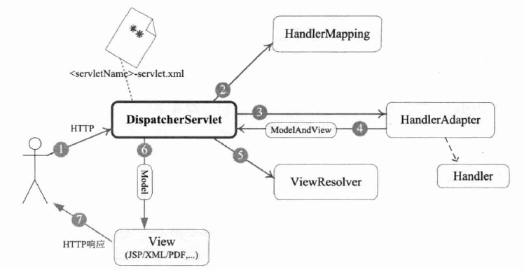

# Spring MVC

Spring Web MVC是构建在Servlet API上的Web框架。

## Spring MVC架构



1. 客户端（如浏览器）发出一个HTTP请求，Web应用服务器接收到这个请求。如果匹配Spring MVC的前端控制器`DispatcherServlet`的URL映射模式，则Web容器将该请求转交给`DispatcherServlet`处理。

2. `DispatcherServlet`接收到这个请求后，将根据请求的信息（包括URL、HTTP方法、请求报文头、请求参数、Cookie等）及处理器映射（HandlerMapping，可看作路由控制器）的配置找到处理请求的处理器（Handler）。

   > 注意：在Spring MVC中并没有定义一个Handler接口，实际上，任何一个类都可以成为请求处理器。

3. 当`DispatcherServlet`找到对应当前请求的处理器后，通过`HandlerAdapter`对处理器进行封装，再以统一的适配器接口调用处理器。

4. 处理器完成业务逻辑的处理后（实际上，设计良好的控制器本身只处理很少甚至不处理工作，而是将业务逻辑委托给一个或多个服务对象进行处理），将返回一个`ModelAndView`给`DispatcherServlet`。`ModelAndView`包含了逻辑视图名和模型数据信息。

5. `DispatcherServlet`借由视图解析器（ViewResolver）来将逻辑视图名匹配为一个特定的视图实现（如JSP）。

6. `DispatcherServlet`将模型数据交付给上一步得到的视图，并由该视图进行渲染。

7. 渲染输出（如HTML、JSON、图片等）最终通过响应对象传递给客户端。

## DispatcherServlet

### 配置DispatcherServlet

传统配置DispatcherServlet的方式是在web.xml文件中进行配置。借助于Servlet 3规范和Spring 3.1的功能增强，现在更推荐在Java中配置DispatcherServlet。

#### 传统的web.xml配置

web.xml：

```xml
<web-app>
  <!-- 加载后端的中间层和数据层组件的应用上下文 -->
  <listener>
    <listener-class>org.springframework.web.context.ContextLoaderListener</listener-class>
  </listener>

  <context-param><!-- ContextLoaderListener加载的Spring配置文件 -->
    <param-name>contextConfigLocation</param-name>
    <param-value>/WEB-INF/app-context.xml</param-value>
  </context-param>

  <!-- 加载Web组件的应用上下文 -->
  <servlet>
    <servlet-name>app</servlet-name>
    <servlet-class>org.springframework.web.servlet.DispatcherServlet</servlet-class>
    <!-- 如果缺省init-param元素，则默认加载 /WEB-INF/Servlet名称-servlet.xml （这里是 /WEB-INF/app-servlet.xml）的Spring配置文件。这里将contextConfigLocation显式设置为空，表示不加载Web组件的应用上下文 -->
    <init-param>
      <param-name>contextConfigLocation</param-name>
      <param-value></param-value>
    </init-param>
    <load-on-startup>1</load-on-startup>
  </servlet>

  <servlet-mapping>
    <servlet-name>app</servlet-name>
    <url-pattern>/app/*</url-pattern>
  </servlet-mapping>
</web-app>
```

一个web.xml可以配置多个`DispatcherServlet`，通过不同的`<servlet-mapping>`配置，让每个`DispatcherServlet`处理不同的请求。

#### 使用Java配置

在Servlet 3环境中，容器会在类路径中查找实现了`javax.servlet.ServletContainerInitializer`接口的类，如果能发现的话，就会用它来配置Servlet容器上下文。

Spring提供了这个接口的实现——`SpringServletContainerInitializer`，这个类会查找实现`WebApplicationInitializer`接口的类，并将配置的任务交给它们来完成。因此，可通过实现`WebApplicationInitializer`接口来配置`DispatcherServlet`和Spring应用上下文。当部署到Servlet 3.0容器中时，容器会自动发现它，并用它来配置Servlet上下文。Spring应用上下文会位于应用程序的Servlet上下文之中：

```java
public class MyWebApplicationInitializer implements WebApplicationInitializer {
    @Override
    public void onStartup(ServletContext servletCxt) {
        // Load Spring web application configuration
        AnnotationConfigWebApplicationContext ac = new AnnotationConfigWebApplicationContext();
        ac.register(AppConfig.class);
        ac.refresh();

        // Create and register the DispatcherServlet
        DispatcherServlet servlet = new DispatcherServlet(ac);
        ServletRegistration.Dynamic registration = servletCxt.addServlet("app", servlet);
        registration.setLoadOnStartup(1);
        registration.addMapping("/app/*");
    }
}
```

Spring 3.2引入了一个便利的`WebApplicationInitializer`基础实现，也就是`AbstractAnnotationConfigDispatcherServletInitializer` ，也可以扩展这个类来配置`DispatcherServlet`和Spring应用上下文：

```java
public class MyWebAppInitializer extends AbstractAnnotationConfigDispatcherServletInitializer {
  @Override
  protected Class<?>[] getRootConfigClasses() {
    return new Class<?>[] { AppConfig.class };
  }

  @Override
  protected Class<?>[] getServletConfigClasses() {
    return null;
  }

  @Override
  protected String[] getServletMappings() {
    return new String[] { "/app/*" };
  }
}
```

### 上下文的层次结构

对于许多应用程序，拥有单个`WebApplicationContext`就足够。但Spring应用上下文之间可以设置为父子级关系，以实现更好的解耦。子上下文可以访问父上下文中的Bean，反之则不行。

在Spring MVC中，通常包含两个应用上下文，并且`DispatcherServlet`加载的Web层应用上下文，将作为`ContextLoaderListener`加载的后端应用上下文的子上下文。


下面的示例配置了这种WebApplicationContext层次结构：

```java
public class MyWebAppInitializer extends AbstractAnnotationConfigDispatcherServletInitializer {
    @Override
    protected Class<?>[] getRootConfigClasses() {
        return new Class<?>[] { RootConfig.class };
    }

    @Override
    protected Class<?>[] getServletConfigClasses() {
        return new Class<?>[] { WebConfig.class };
    }

    @Override
    protected String[] getServletMappings() {
        return new String[] { "/app/*" };
    }
}
```

或者：

```xml
<web-app>
  <listener>
    <listener-class>org.springframework.web.context.ContextLoaderListener</listener-class>
  </listener>

  <context-param>
    <param-name>contextConfigLocation</param-name>
    <param-value>/WEB-INF/root-context.xml</param-value>
  </context-param>

  <servlet>
    <servlet-name>app</servlet-name>
    <servlet-class>org.springframework.web.servlet.DispatcherServlet</servlet-class>
    <init-param>
      <param-name>contextConfigLocation</param-name>
      <param-value>/WEB-INF/web-context.xml</param-value>
    </init-param>
    <load-on-startup>1</load-on-startup>
  </servlet>

  <servlet-mapping>
    <servlet-name>app</servlet-name>
    <url-pattern>/app/*</url-pattern>
  </servlet-mapping>
</web-app>
```

## MVC配置

### 启用Spring MVC

在基于Java的配置中，可以在Servlet的应用上下文配置类中通过`@EnableWebMvc`标注来启用Spring MVC：

```java
@Configuration
@EnableWebMvc
public class WebConfig {
  …
}
```

在基于XML的配置中，可以使用下面配置启用标注驱动的Spring MVC：

```xml
<?xml version="1.0" encoding="UTF-8"?>
<beans xmlns="http://www.springframework.org/schema/beans"
    xmlns:mvc="http://www.springframework.org/schema/mvc"
    xmlns:xsi="http://www.w3.org/2001/XMLSchema-instance"
    xsi:schemaLocation="
        http://www.springframework.org/schema/beans
        http://www.springframework.org/schema/beans/spring-beans.xsd
        http://www.springframework.org/schema/mvc
        http://www.springframework.org/schema/mvc/spring-mvc.xsd">

  <mvc:annotation-driven/>

</beans>
```

### 启用组件扫描

```java
@Configuration
@EnableWebMvc
@ComponentScan("spitter.web")
public class WebConfig {
  …
}
```

## 控制器

### 声明

Spring MVC的控制器不需要继承任何类或接口，只需要在控制器的方法上标注上`@RequestMapping`即可。`@RequestMapping`将HTTP请求映射到指定的方法。而`@Controller`标注主要是在自动装配时辅助组件扫描的。

`@RequestMapping`既可只作用在方法上，也可以同时作用在方法和类上：

```java
@Controller
@RequestMapping("/foo")
public class FooController {
  @RequestMapping("/bar")
  public String bar(Model model) {
    model.addAttribute("name", "Mary");
    return "/bar.ftl";
  }
}
```

则对`/foo/bar`的请求，将交由`FooController.bar`方法处理。

控制器方法返回值默认是视图的名称，`DispatcherServlet`会要求视图解析器将这个逻辑视图名称解析为实际的视图。

如果希望返回内容本身，而不是视图名称，则需要在方法上加上`@ResponseBody`。`@ResponseBody`用于将控制器的方法返回值，通过相应的`HttpMessageConverter`转换为指定格式后，写入`Response`对象的body。默认情况下，如果返回值是字符串类型，则直接返回这个字符串；否则，默认使用Jackson将返回值序列化为JSON字符串后输出。

如果需要的是一个RESTful风格的控制器，则需要使用`@RestController`标注，它相当于`@Controller`+`@ResponseBody`，用于返回JSON格式数据。

### 请求映射

`@RequestMapping`的属性：

- value：请求的URL路径，支持URL模板、正则表达式。`value`属性能够接受一个`String`类型的数组：

  ```java
  @Controller
  @RequestMapping({"/", "/home"})
  public class HomeController {
    …
  }
  ```

- method：HTTP请求方法，有GET、POST等；

- consumes：接受的媒体类型。对应HTTP的`Content-Type`；

- produces：响应的媒体类型。对应HTTP的`Accept`；

- params：请求参数；

- headers：请求的HTTP头。

另外，根据请求方法的不同，还可以使用`@GetMapping`、`@PostMapping`、`@PutMapping`、`@DeleteMapping`和`@PatchMapping`等简便标注代替。

#### URL模式

##### 路径参数

```java
@RequestMapping(value="/get/{id}.json")
public @ResponseBody User getById(@PathVariable("id") Long id) {
  …
}
```

则访问路径是`/get/1.json`，时将调用`getById`方法，并且参数`id`的值为`1`。

> 标注中如果只设置一个`value`参数时，可以省略`value=`部分。例如：`@RequestMapping("/get/{id}.json")`。

##### Ant路径表达式

`*`匹配任意多个字符（除了路径分隔符”/“），`**`匹配任意路径，`?`匹配单个字符。

```java
@RequestMapping("/user/*.html")  //匹配：/user/1.html、/user/abc.html，但不匹配：/user/add/1.html
@RequestMapping("/**/1.html")  //匹配：/1.html、/user/1.html、/user/add/1.html
@RequestMapping("/user/?.html")  //匹配：/user/1.html，但不匹配：/user/abc.html
```

如果一个请求有多个`@RequestMapping`能够匹配，则更具体的匹配优先。另外，有通配符的低于无通配符的，有`**`的低于有`*`的。

##### 插值

在URL映射中，可以使用`${…}`的插值（SpEL），来获取系统配置或环境变量：

```java
@RequestMapping("/${query.all}.json")
```

#### HTTP HEAD、OPTIONS

### 处理器方法

## 根上下文配置

```java
package spittr.config;

…

@Configuration
@ComponentScan(
  basePackages={"spitter"},
  excludeFilters={
    @Filter(type=FilterType.ANNOTATION, value=EnableWebMvc.class)
  })
public class RootConfig {
  …
}
```

组件扫描时，过滤掉以`@EnableWebMvc`标注的类。

# Spring WebFlux